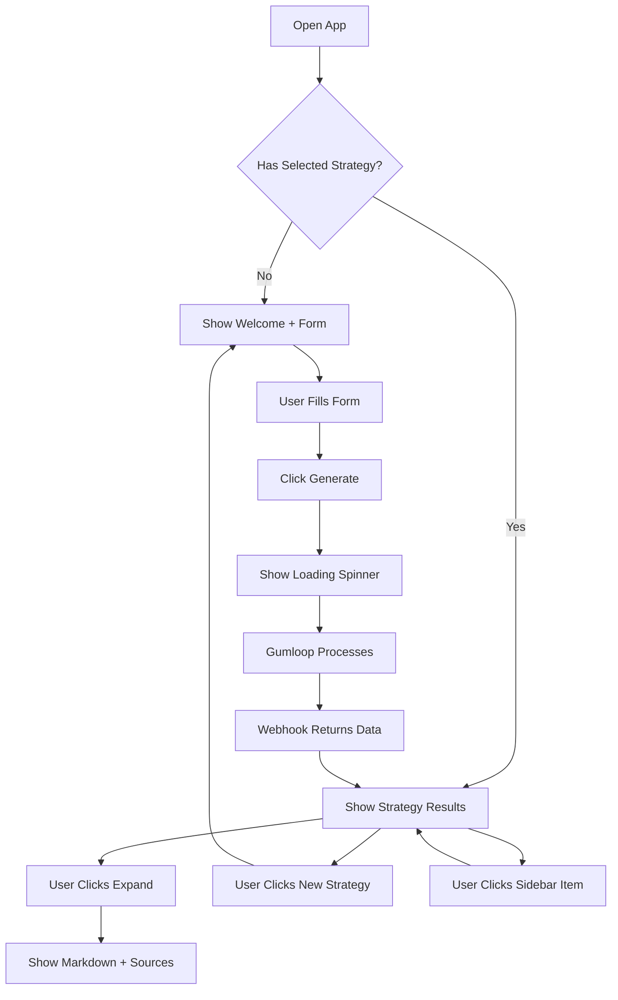

# Interface Guide - Strategy Generator

## 🎯 Overview
Clean, form-based interface for generating account strategies with AI.

---

## 📋 Main Components

### 1. Sidebar
```
┌─────────────────────────┐
│ 🏥 PicnicHealth    [<] │  ← Logo + Collapse
├─────────────────────────┤
│                         │
│  [+ New Strategy]       │  ← Primary action
│                         │
│  Recent Strategies      │
│  ─────────────────      │
│  💬 Q4 2025 J&J...     │  ← Clickable
│  💬 Pfizer Expansion   │
│  💬 Merck Strategy     │
│                         │
└─────────────────────────┘
```

### 2. Form View (New Strategy)
```
┌──────────────────────────────────────────────┐
│                                              │
│              ✨                              │
│    Account Strategy Planning                │
│  Generate comprehensive account              │
│   strategies powered by AI                   │
│                                              │
│  ┌────────────────────────────────────────┐ │
│  │ New Strategy                           │ │
│  │                                        │ │
│  │ Strategy Title                         │ │
│  │ [Q4 2025 J&J Oncology Strategy___]    │ │
│  │                                        │ │
│  │ Context & Requirements                 │ │
│  │ ┌────────────────────────────────────┐ │ │
│  │ │ Describe the account, objectives,  │ │ │
│  │ │ focus areas, or specific...        │ │ │
│  │ │                                    │ │ │
│  │ └────────────────────────────────────┘ │ │
│  │                                        │ │
│  │ Supporting Documents (Optional)        │ │
│  │ [📎 Attach file_______________] [X]   │ │
│  │ Upload relevant documents              │ │
│  │                                        │ │
│  │ [✨ Generate Strategy]                 │ │
│  └────────────────────────────────────────┘ │
│                                              │
└──────────────────────────────────────────────┘
```

### 3. Loading State
```
┌──────────────────────────────────────────────┐
│                                              │
│                                              │
│              ⟳ (spinning)                    │
│                                              │
│         Generating Strategy...               │
│         This may take a moment               │
│                                              │
│                                              │
└──────────────────────────────────────────────┘
```

### 4. Results View
```
┌──────────────────────────────────────────────┐
│ Q4 2025 J&J Oncology Strategy  [Expand][v]  │  ← Header
│ ✓ complete  •  Oct 7, 2025                  │
├──────────────────────────────────────────────┤
│                                              │
│ ┌──────────────────────────────────────────┐ │
│ │ Priorities                          [v]  │ │  ← Expandable
│ │ 3 source(s)                              │ │
│ ├──────────────────────────────────────────┤ │
│ │ ## Top Priorities                        │ │
│ │                                          │ │
│ │ - Priority 1 description...              │ │
│ │ - Priority 2 description...              │ │
│ │ - Priority 3 description...              │ │
│ │                                          │ │
│ │ Sources                                  │ │
│ │ 🔗 https://source1.com                   │ │
│ │ 🔗 https://source2.com                   │ │
│ └──────────────────────────────────────────┘ │
│                                              │
│ ┌──────────────────────────────────────────┐ │
│ │ Key Assets & Programs              [>]  │ │  ← Collapsed
│ │ 2 source(s)                              │ │
│ └──────────────────────────────────────────┘ │
│                                              │
│ ┌──────────────────────────────────────────┐ │
│ │ Opportunities                      [>]  │ │
│ │ 4 source(s)                              │ │
│ └──────────────────────────────────────────┘ │
│                                              │
│ ┌──────────────────────────────────────────┐ │
│ │ Key Contacts                       [>]  │ │
│ │ 3 source(s)                              │ │
│ └──────────────────────────────────────────┘ │
│                                              │
└──────────────────────────────────────────────┘
```

---

## 🎨 Design Principles

### 1. **Clean & Simple**
- No chat interface confusion
- One form, one action
- Clear visual hierarchy

### 2. **Professional**
- Markdown rendering with proper typography
- Expandable sections for focused reading
- Source attribution for credibility

### 3. **Efficient**
- Quick access to past strategies in sidebar
- Expand/collapse all for power users
- Keyboard-friendly form inputs

---

## 🔄 User Journey



---

## 💾 Data Format

### Input (Form Submission)
```json
{
  "title": "Q4 2025 J&J Oncology Strategy",
  "status": "generating",
  "inputs": {
    "context": "Focus on oncology expansion...",
    "hasFile": true
  }
}
```

### Output (Gumloop Webhook)
```json
{
  "strategyId": "abc-123-def-456",
  "priorities": {
    "markdown": "## Top Priorities\n\n- Expand oncology portfolio\n- Build key relationships",
    "sources": [
      "https://jnj.com/oncology",
      "https://research.source.com"
    ]
  },
  "keyAssets": {
    "markdown": "## Key Assets\n\n- Drug A: Leading product\n- Program B: Clinical trials",
    "sources": ["https://pipeline.jnj.com"]
  },
  "opportunities": {
    "markdown": "## Opportunities\n\n- Partnership potential\n- Market expansion",
    "sources": ["https://industry.report.com"]
  },
  "contacts": {
    "markdown": "## Key Contacts\n\n- John Doe, VP Oncology\n- Jane Smith, Director R&D",
    "sources": ["https://linkedin.com/in/..."]
  }
}
```

---

## 🎯 Key Features

### ✅ Form-Based Input
- Clear, structured input
- Optional file upload
- No confusion about what to enter

### ✅ Markdown Display
- Rich text formatting
- Headers, lists, links
- Code blocks and tables supported

### ✅ Expandable Sections
- Click header to expand/collapse
- Saves screen space
- Focus on what matters

### ✅ Source Attribution
- Every section can show sources
- Clickable external links
- Builds trust and credibility

### ✅ Strategy History
- All strategies in sidebar
- Click to load instantly
- Never lose your work

---

## 📱 Responsive Design

- **Desktop:** Full sidebar + main content
- **Tablet:** Collapsible sidebar
- **Mobile:** Overlay sidebar, full-width content

---

## 🚀 Next Steps

1. **Integrate Gumloop webhook** to receive real strategy data
2. **Add file upload handling** to process attached documents
3. **Implement real-time updates** when strategy completes
4. **Add export functionality** (PDF, Word, etc.)
5. **Enable strategy editing** for fine-tuning results

---

**Design Status:** ✅ Complete
**Developer Experience:** Clean, maintainable code
**User Experience:** Simple, intuitive, professional

